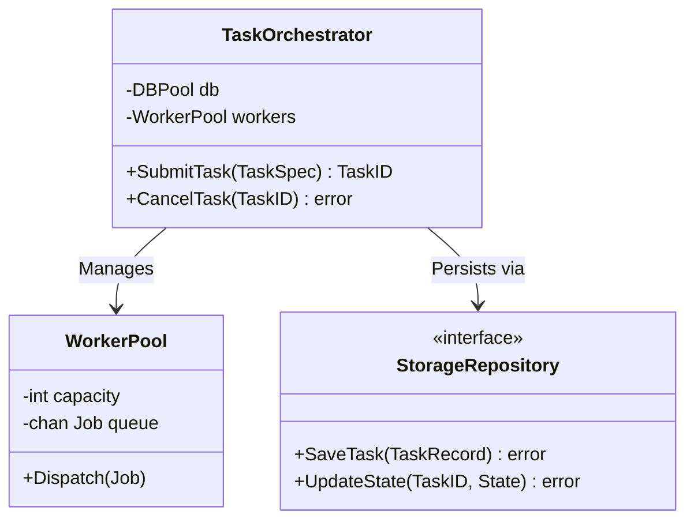
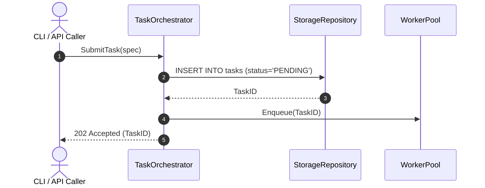

# Software Design Documents (SDD) & Technical Blueprints

This directory houses the **pre-implementation technical blueprints** for platform subsystems and services, bridging the **Analysis & Design Discipline** and **Implementation Discipline** of the Unified Software Development Process (USDP / UP).

---

## 1. Canonical Framework & Standards

* **Governing Framework:** [IEEE 1016-2009 (Standard for Information Technology—Systems Design—Software Design Descriptions)](https://ieeexplore.ieee.org/document/5167266), Google Design Doc Standards (Malte Ubl / Angela Zhang), and Atlassian Work-Management SDD Guidelines.
* **Format:** Prescriptive technical blueprints containing UML diagrams, data persistence schemas, API contracts, and phased PR execution checklists (`NNNN_descriptive_title.md`).
* **Canonical Path:** `architecture/designs/`

---

## 2. Directives & Quality Invariants

1. **Pre-Implementation Requirement:** An SDD must be drafted, reviewed, and approved before engineers write non-trivial production code.
2. **The Vacation Test:** The technical specification must be sufficiently complete that an independent engineer could implement, test, and deploy the subsystem without consulting the original author.
3. **The Skeptic Test:** The introduction must rigorously justify *why* the subsystem is being built and why simpler existing scripts or tools are insufficient.
4. **Mandatory Visual Models:** Every SDD must incorporate at least two visual Mermaid diagrams:
   * Structural Model (Class or Component diagram).
   * Dynamic Flow (Sequence diagram).
   * State Machine (Entity lifecycle state transitions).
5. **No Monolithic PRs:** Section 4 must sequence the implementation into discrete, reviewable pull-request milestones.

---

## 3. SDD Template Example

````markdown
---
title: "SDD-004: Workstation Task Orchestration Subsystem Design"
status: "in-progress" # draft | under-review | approved | in-progress | completed | superseded
authors: ["@mnaatjes"]
reviewers: ["@lead-dev", "@platform-architect"]
created_at: "YYYY-MM-DD"
last_updated_at: "YYYY-MM-DD"
related_adrs: ["architecture/adr/0002_use_postgresql.md"]
related_rfcs: ["architecture/rfcs/0001_task_orchestration_proposal.md"]
---

# SDD-004: Workstation Task Orchestration Subsystem Design

## 1. Executive Summary & Policy Distillation
* **Policy Context:** Per [ADR-0002](architecture/adr/0002_use_postgresql.md), all task execution telemetry must be persisted to PostgreSQL with strict ACID guarantees.
* **Objective:** Design the internal `TaskOrchestrator` service, worker concurrency queue, and retry policies.
* **Non-Goals:** Does NOT manage cluster-wide distributed consensus or arbitrary user container workloads.

## 2. Architectural Blueprint & UML Models

### 2.1 Component & Interface Model


### 2.2 Dynamic Execution Flow (Sequence)


## 3. Data Schema & Persistence Blueprint
```sql
CREATE TABLE tasks (
    id UUID PRIMARY KEY DEFAULT gen_random_uuid(),
    name VARCHAR(255) NOT NULL,
    status VARCHAR(50) NOT NULL DEFAULT 'PENDING',
    retry_count INT NOT NULL DEFAULT 0,
    created_at TIMESTAMPTZ NOT NULL DEFAULT NOW()
);
CREATE INDEX idx_tasks_status ON tasks(status);
```

## 4. Phased Implementation Plan & PR Checklist
* [ ] **Phase 1: Storage Layer & Migrations (PR #1):** Database DDL scripts and repository interfaces.
* [ ] **Phase 2: Worker Pool & Concurrency Engine (PR #2):** Concurrency queues and graceful cancellation.
* [ ] **Phase 3: Public API & CLI Wiring (PR #3):** REST endpoints and CLI subcommands.
* [ ] **Phase 4: Telemetry & Hardening (PR #4):** Metrics, tracing spans, and chaos test suites.

## 5. Verification & Testing Strategy
* **Unit Tests:** Mock storage repository to simulate disk failure and retry behavior.
* **Integration Tests (Pytest):** Verify end-to-end task execution against containerized PostgreSQL.
````
