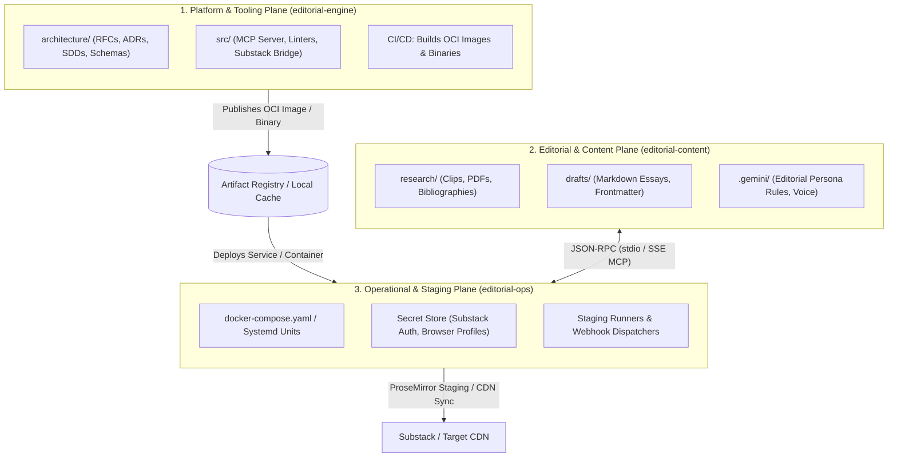
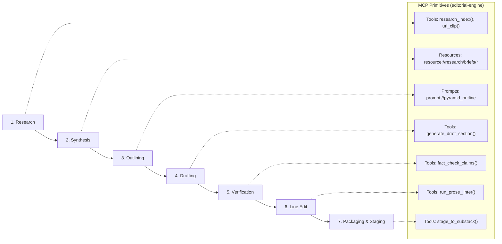

# RFC 0001: Multi-Plane Repository Topology and Editorial Pipeline Architecture

## 1. Overview / Summary

This Request for Comments (RFC) articulates the architectural decomposition and multi-repository topology for an AI-assisted editorial and publishing platform targeting Substack and long-form technical publications. The core design decouples software engineering governance and tool source code from the authoring workspace and operational deployment environments.

By formalizing the separation into three primary planes—**Tooling & Governance (`editorial-engine`)**, **Editorial & Content (`editorial-content`)**, and **Deployment & Infrastructure (`editorial-ops`)**—the system eliminates context window pollution, prevents operational secret leakage into authoring spaces, and establishes a standardized Model Context Protocol (MCP) boundary across all lifecycles.



---

## 2. Problem Statement & Context

Coupling editorial prose, raw research artifacts, tool source code, and deployment automation within a monolithic repository degrades both the authoring experience and engineering lifecycle:

1. **Context Window Contamination:** Modern agentic LLM assistants (e.g., Antigravity, Gemini CLI) recursively scan workspace trees. Ingesting infrastructure manifests, node modules, Python virtual environments, and test fixtures during a drafting session wastes token budgets and causes hallucinations.
2. **Security & Boundary Violation:** Staging drafts to Substack requires session tokens, browser automation cookies, or platform credentials. Storing or referencing these credentials in an authoring workspace presents accidental leakage risks.
3. **Mismatched Lifecycles:** Editorial drafts evolve non-linearly with rapid commits and revisions. Infrastructure and platform tooling require strict versioning, linting, regression testing, and architectural review (MADRs, SDDs).
4. **Tool Portability Constraints:** Hardcoding custom scripts to specific file paths prevents re-using the editorial tooling across multiple distinct publications or private research vaults.

### Goals & Non-Goals

* **Goals:**
  * Define strict physical and logical repository boundaries for the editorial ecosystem.
  * Define the Model Context Protocol (MCP) interface contract connecting authoring environments to background tool execution.
  * Guarantee zero source code and zero operational credentials reside within the writing workspace.
  * Support the complete 7-stage professional editorial lifecycle (Research $\rightarrow$ Synthesis $\rightarrow$ Outlining $\rightarrow$ Drafting $\rightarrow$ Fact-Checking $\rightarrow$ Line Editing $\rightarrow$ Packaging).
* **Non-Goals:**
  * Re-implementing a native Markdown editor (the system integrates with existing editors via standard MCP clients).
  * Supporting multi-tenant collaborative SaaS drafting in phase 1 (focused on single-author sovereign homelab workflow).

---

## 3. Proposed Architecture & Repository Topology

### 3.1 Repository Taxonomy Breakdown

| Repository Name | Target Persona | Plane / Responsibility | Authoritative Contents |
| :--- | :--- | :--- | :--- |
| **`editorial-engine`** | Software Engineer / System Architect | **Governance & Source Code Plane** | • `architecture/` (RFCs, MADRs, IEEE 1016 SDDs, OpenAPI/JSON-RPC schemas).<br>• Core source code for custom MCP servers (`src/mcp_server/`).<br>• Custom linter definitions, style rule engines (Vale rules), and readability evaluators.<br>• Unit, integration, and contract tests.<br>• CI/CD packaging pipelines (Containerfiles, binary builds). |
| **`editorial-content`** | Writer / Research Essayist | **Authoring & Editorial Plane** | • `research/` (Clips, PDFs, reading notes, citations).<br>• `drafts/` (Active essays, structural outlines, revision histories).<br>• `assets/` (Visual diagrams, cover images, tables).<br>• `.gemini/` (Editorial persona directives, voice guidelines).<br>• *Zero application code, zero build tools, zero deployment scripts.* |
| **`editorial-ops`** | Systems / DevOps Operator | **Deployment & Staging Plane** | • Container deployment manifests (`docker-compose.yaml`).<br>• Secret management bindings (Substack credentials, browser state sessions).<br>• Host-level execution definitions (systemd user services, cron jobs).<br>• End-to-end publishing runners and webhooks. |

---

### 3.2 System Interconnect & The MCP Protocol Boundary

The bridge between `editorial-content` and `editorial-engine` is governed strictly by the **Model Context Protocol (JSON-RPC 2.0)**, avoiding custom bespoke REST client code inside the writing workspace.

#### Communication Pattern: Detached Runtime via Network MCP (SSE) or Local Stdio
* **Network Mode (Recommended for Server / Headless Container):**
  * `editorial-ops` runs the `editorial-engine` daemon in a local container or systemd service on port `8765`.
  * The writer's environment (`editorial-content`) contains only a declarative client configuration file:
    ```json
    {
      "mcpServers": {
        "editorial": {
          "url": "http://127.0.0.1:8765/sse"
        }
      }
    }
    ```
* **Local Subprocess Mode (Self-Contained Single Binary):**
  * `editorial-engine` compiles an immutable release binary (`editorial-cli`).
  * The authoring environment launches it dynamically:
    ```json
    {
      "mcpServers": {
        "editorial": {
          "command": "editorial-cli",
          "args": ["mcp", "--vault", "."]
        }
      }
    }
    ```

---

### 3.3 Functional Mapping of the 7-Stage Editorial Lifecycle

The `editorial-engine` exposes standardized MCP Tools, Resources, and Prompts mapped directly to the professional editorial workflow:



1. **Stage 1: Ingestion & Research:** Tool `research_query(query)` parses local Markdown notes and retrieves cited PDFs.
2. **Stage 2: Synthesis:** Resource `resource://research/synthesis_matrix` exposes extracted claims and counter-arguments as read-only context.
3. **Stage 3: Thesis & Outlining:** Prompt `prompt://structural_outline` enforces the Minto Pyramid Principle without generating conversational filler.
4. **Stage 4: Drafting:** Contextual generation expanding bullet outlines into prose while preserving `[TK]` verification placeholders.
5. **Stage 5: Fact-Checking:** Tool `verify_assertions(file_path)` cross-references draft claims against source documents in `research/`.
6. **Stage 6: Multi-Pass Line Editing:** Tool `lint_prose(file_path)` executes Vale and readability metrics (Flesch-Kincaid, passive voice density) with granular line-level feedback.
7. **Stage 7: Packaging & Staging:** Tool `stage_draft(file_path)` translates local Markdown into ProseMirror JSON and stages a draft in Substack via `editorial-ops` automation.

---

## 4. Alternatives Considered & Trade-Off Matrix

| Architectural Dimension | Option A: Monorepo Architecture | Option B: Custom REST API Service | Option C: Multi-Plane Decoupled Topology with MCP (Recommended) |
| :--- | :--- | :--- | :--- |
| **Workspace Hygiene** | Poor: Code, node modules, and essays coexist in one Git tree. | Moderate: Content is separate, but requires custom client scripts. | **Excellent**: Content repository holds only Markdown and media assets. |
| **Context Window Consumption** | High: LLM indexing pulls infrastructure code into drafting sessions. | Minimal: Only queries specific API endpoints. | **Optimal**: LLM discovers tools via JSON-RPC schema without scanning source trees. |
| **Client Maintenance Overhead** | High: Every environment update requires rebuilding workspace hooks. | High: Must maintain custom curl/Python API clients in the writer's editor. | **Zero**: Uses native MCP client integrations built into AGY, Claude, and Cursor. |
| **Credential Security** | Low: Production publishing keys stored alongside working drafts. | Good: API acts as a gateway to credentials. | **Complete**: Credentials isolated strictly within the `editorial-ops` execution plane. |
| **Tool Portability** | None: Hardcoded to the single repository directory. | Moderate: Reusable, but requires custom API client setup per repo. | **Universal**: Any Markdown workspace can mount the engine via `.gemini/antigravity.json`. |

---

## 5. Security, Risk & Operational Impact

* **Secret Isolation:** Substack session tokens, session cookies, and API secrets are never checked into `editorial-content` or exposed to the client LLM context. They are injected as environment variables exclusively inside the container managed by `editorial-ops`.
* **Filesystem Containment:** In network mode, `editorial-engine` operates only on paths explicitly mounted into the service container. Path traversal outside the configured publication root is rejected at the protocol layer.
* **Failure Modes:** If `editorial-engine` crashes or is offline, the writer's ability to author, review, or edit local Markdown files remains completely unimpeded; only AI tool augmentation is temporarily unavailable.

---

## 6. Implementation Phases & Downstream Artifacts

1. **Phase 1: Inception & Consensus (This RFC)**
   * Complete RFC review and ratify boundary decisions.
   * Author binding MADR: `architecture/adr/0001_mcp_editorial_protocol_boundary.md`.
2. **Phase 2: Protocol Interface Specification**
   * Author OpenAPI/JSON-RPC schema contract: `architecture/api/editorial_mcp_contract.json`.
3. **Phase 3: Core Implementation (`editorial-engine`)**
   * Implement MCP server exposing the 7-stage editorial tools.
   * Build container packaging.
4. **Phase 4: Operational Staging (`editorial-ops`)**
   * Configure Docker Compose deployment and headless Substack staging bridge.
5. **Phase 5: Content Workspace Initialization (`editorial-content`)**
   * Setup pure Markdown directory layout and configure `.gemini/antigravity.json`.
