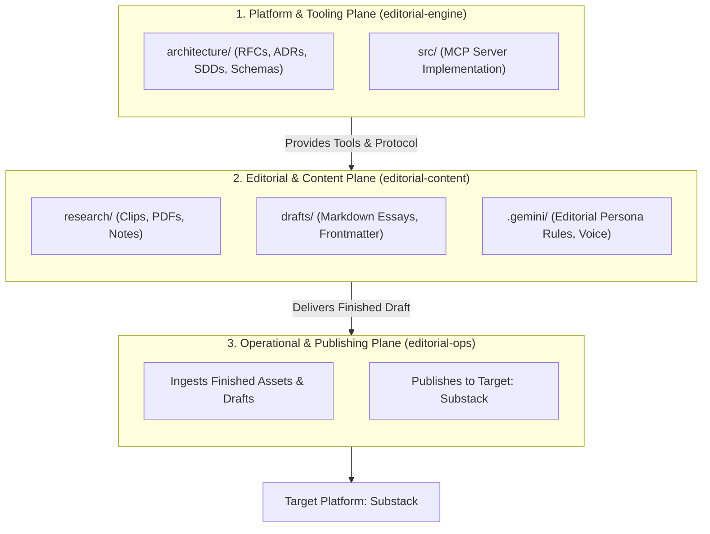
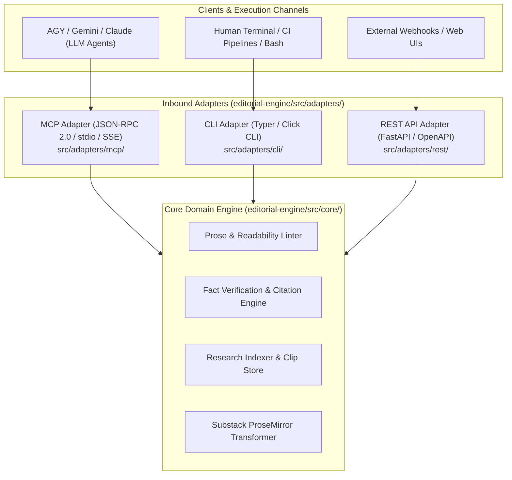
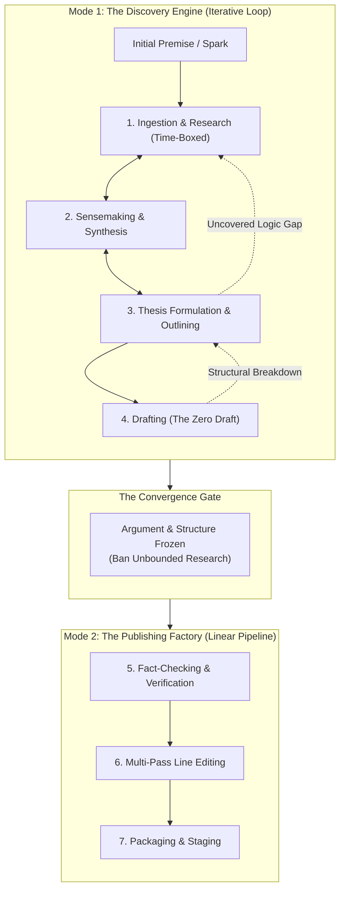

# RFC 0001: Multi-Plane Repository Topology and Editorial Pipeline Architecture

## 1. Overview / Summary

This Request for Comments (RFC) articulates the architectural decomposition and multi-repository topology for an AI-assisted editorial and publishing platform targeting Substack and long-form technical publications. The core design decouples software engineering governance and tool source code from the authoring workspace and operational deployment environments.

By formalizing the separation into three primary planes—**Tooling & Governance (`editorial-engine`)**, **Editorial & Content (`editorial-content`)**, and **Deployment & Infrastructure (`editorial-ops`)**—the system eliminates context window pollution, prevents operational secret leakage into authoring spaces, and establishes a standardized Model Context Protocol (MCP) boundary across all lifecycles.

---

## 2. Problem Statement & Context

Coupling editorial prose, raw research artifacts, tool source code, and deployment automation within a monolithic repository degrades both the authoring experience and engineering lifecycle:

1. **Context Window Contamination:** Modern agentic LLM assistants (e.g., Antigravity, Gemini CLI) recursively scan workspace trees. Ingesting infrastructure manifests, node modules, Python virtual environments, and test fixtures during a drafting session wastes token budgets and causes hallucinations.
2. **Security & Boundary Violation:** Staging drafts to Substack requires session tokens, browser automation cookies, or platform credentials. Storing or referencing these credentials in an authoring workspace presents accidental leakage risks.
3. **Mismatched Lifecycles:** Editorial drafts evolve non-linearly with rapid commits and revisions. Infrastructure and platform tooling require strict versioning, linting, regression testing, and architectural review (MADRs, SDDs).
4. **Tool Portability Constraints:** Hardcoding custom scripts to specific file paths prevents re-using the editorial tooling across multiple distinct publications or private research vaults.

### Goals & Non-Goals

* **Goals:**
  * Define strict physical and logical repository boundaries for the editorial ecosystem.
  * Define the Model Context Protocol (MCP) interface contract connecting authoring environments to background tool execution.
  * Guarantee zero source code and zero operational credentials reside within the writing workspace.
  * Establish a clear 7-stage professional editorial lifecycle framework (Research $\rightarrow$ Synthesis $\rightarrow$ Outlining $\rightarrow$ Drafting $\rightarrow$ Fact-Checking $\rightarrow$ Line Editing $\rightarrow$ Packaging).
* **Non-Goals:**
  * Re-implementing a native Markdown editor (the system integrates with existing editors via standard MCP clients).
  * Supporting multi-tenant collaborative SaaS drafting in phase 1 (focused on single-author sovereign homelab workflow).

---

## 3. Proposed Architecture & Repository Topology

### 3.1 Repository Taxonomy Breakdown

| Repository Name | Target Persona | Plane / Responsibility | Authoritative Contents |
| :--- | :--- | :--- | :--- |
| **`editorial-engine`** | Software Engineer / System Architect | **Governance & Source Code Plane** | • `architecture/` (RFCs, MADRs, IEEE 1016 SDDs, OpenAPI/JSON-RPC schemas). • Core source code for custom MCP servers (`src/`). • Custom linter definitions, style rule engines, and readability evaluators. • Unit, integration, and contract tests. |
| **`editorial-content`** | Writer / Research Essayist | **Authoring & Editorial Plane** | • `research/` (Clips, PDFs, reading notes, citations). • `drafts/` (Active essays, structural outlines, revision histories). • `assets/` (Visual diagrams, cover images, tables). • `.gemini/` (Editorial persona directives, voice guidelines). • *Zero application code, zero build tools, zero deployment scripts.* |
| **`editorial-ops`** | Systems / DevOps Operator | **Deployment & Staging Plane** | • Container and process management manifests. • Secret management bindings for platform authentication. • Automated collectors and delivery scripts publishing finished content to Substack. |

---

### 3.2 Hexagonal Architecture & Protocol Decoupling

To ensure sovereignty, resilience, and flexibility, `editorial-engine` is designed using the **Hexagonal Architecture (Ports & Adapters)** pattern. The system is not inherently coupled to the Model Context Protocol or to any specific LLM client; rather, the core business domain is strictly separated from external transaction protocols.

**Language Standardization:** Python (3.12+) is the mandatory, unified language for all core application services, library logic, linters, and protocol adapters across the `editorial-engine` repository.

#### 1. Core Domain Layer (`editorial-engine/src/core/`)
* Implemented in pure, framework-agnostic Python.
* Houses 100% of the editorial logic: markdown parsing, frontmatter validation, citation cross-referencing, Vale/style linting wrappers, and Substack ProseMirror schema translations.
* Completely free of transport dependencies (no MCP, FastAPI, or CLI framework imports).

#### 2. Protocol Adapters (`editorial-engine/src/adapters/`)
All adapters are written in Python and maintained directly inside the **`editorial-engine`** repository, exposing distinct interaction surfaces over the identical core library:

* **CLI Adapter (`src/adapters/cli/`):**
  * Provides a direct command-line interface for human authors and automated shell scripts.
  * Allows running linters, research indexing, and publishing directly from the terminal without requiring an LLM or network connection (e.g., `editorial-cli lint drafts/essay.md`).
* **MCP Adapter (`src/adapters/mcp/`):**
  * Implements the Model Context Protocol (using the official Python `mcp` SDK).
  * Exposes core functions as MCP Tools, Resources, and Prompts over `stdio` and `SSE` for AGY, Gemini, Cursor, or Claude Desktop.
* **REST API Adapter (`src/adapters/rest/`):**
  * Implements a standard HTTP REST service using FastAPI.
  * Generates interactive OpenAPI 3.1 contracts (`/docs`) for programmatic webhooks, third-party microservices, or custom web dashboards.

---

### 3.3 The 7-Stage Editorial Lifecycle: Two Operating Modes

Rather than an inflexible waterfall sequence, the editorial and authoring workflow operates in two distinct operational modes separated by a formal **Convergence Gate**:

* **Mode 1: The Discovery Engine (Iterative / Recursive):** Stages 1 through 4 are inherently dialectical and non-linear. An initial premise prompts research, which informs synthesis, which refines the thesis, exposing logic gaps that trigger targeted research spikes.
* **Mode 2: The Publishing Factory (Deterministic / Linear):** Stages 5 through 7 engage once the structural argument is frozen. Work shifts from creative discovery to mechanical verification, stylistic polishing, and asset compilation.

#### Detailed Stage Breakdown

1. **Stage 1: Ingestion & Research:** Systematic capture of primary source materials, academic publications, whitepapers, interview transcripts, and bookmarks into local archives.
   * *Requirement: Time-Boxed Research Spikes:* To prevent the "infinite research spiral" anti-pattern, research phases must operate under explicit time bounds or bounded scopes (e.g., investigating a specific counter-argument for a fixed window before advancing).
2. **Stage 2: Sensemaking & Synthesis:** Extracting core patterns, claims, tensions, and verified data points from research materials into a structured research brief without drafting prose.
3. **Stage 3: Thesis Formulation & Outlining:** Establishing the central thesis statement (governing thought) and building a detailed hierarchical outline (e.g., Minto Pyramid structure) mapping arguments to citations.
4. **Stage 4: Drafting (The Zero Draft):** Rapid, unconstrained translation of the outline into full prose, deliberately bypassing internal self-critique and using placeholders (`[TK]`) for missing data to preserve velocity.
5. **Stage 5: Fact-Checking & Verification:** Rigorous verification pass resolving all `[TK]` placeholders, validating claims against primary sources, and verifying numerical accuracy.
6. **Stage 6: Multi-Pass Line Editing:** Progressive editorial passes refining voice, cadence, clarity, and grammatical hygiene (structural flow $\rightarrow$ line editing $\rightarrow$ copyediting/proofreading).
7. **Stage 7: Packaging & Staging:** Assembly of publication-ready assets including headlines, email pre-headers, pull quotes, 16:9 banner art, and social hooks prior to handing off to operations for publishing.

---

## 4. Alternatives Considered: REST API vs. MCP

* **Custom REST API:** Exposing traditional HTTP/REST endpoints from `editorial-engine` requires writing and maintaining custom client-side glue code, tool adapters, or curl commands inside the writer's environment. Furthermore, OpenAPI schemas must be manually updated whenever server endpoints change.
* **Model Context Protocol (Recommended):** MCP standardizes tool capability negotiation and resource streaming over JSON-RPC 2.0. Native MCP support in modern AI clients (Antigravity, Gemini CLI, Claude, Cursor) enables dynamic runtime discovery without writing client-side boilerplate, while preserving local-first security.

---

## 5. Security, Risk & Operational Impact

* **Secret Isolation:** Substack session tokens, session cookies, and API secrets are never checked into `editorial-content` or exposed to the client LLM context. They are managed exclusively within the operational plane (`editorial-ops`).
* **Filesystem Containment:** `editorial-engine` operates only on paths explicitly designated for authoring. Path traversal outside the configured publication root is rejected.
* **Failure Modes:** If `editorial-engine` is offline, the writer's ability to author, review, or edit local Markdown files remains completely functional; only AI assistance is temporarily unavailable.

---

## 6. Next Steps

1. Review and ratify this high-level repository topology and lifecycle proposal.
2. Define the functional requirements and editorial interaction models for Stages 1 through 7 prior to designing specific MCP primitives.
3. Perform RFC review
