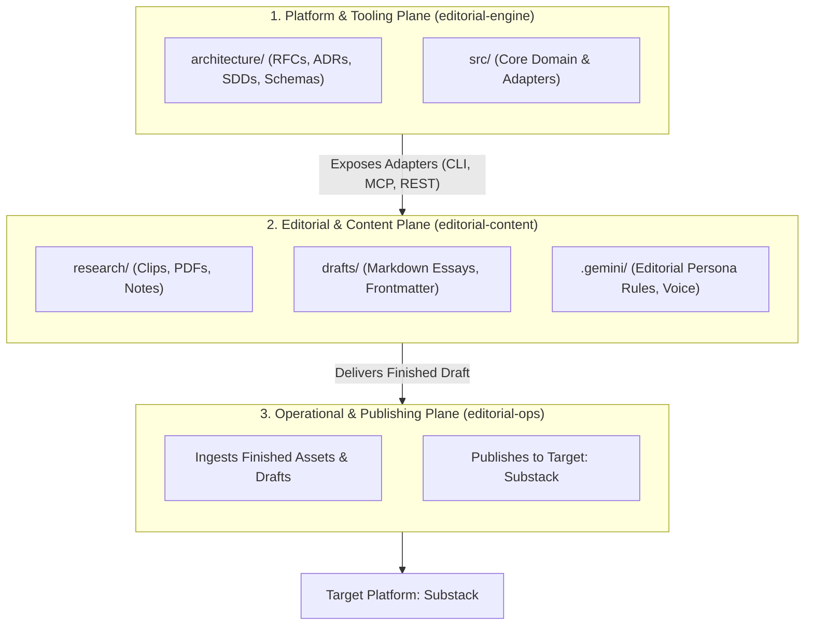
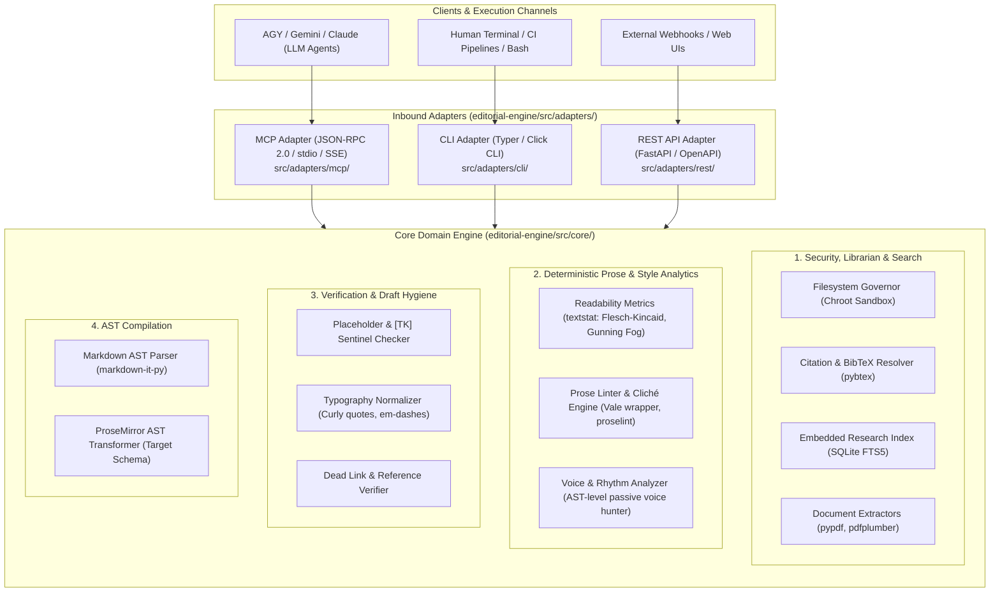
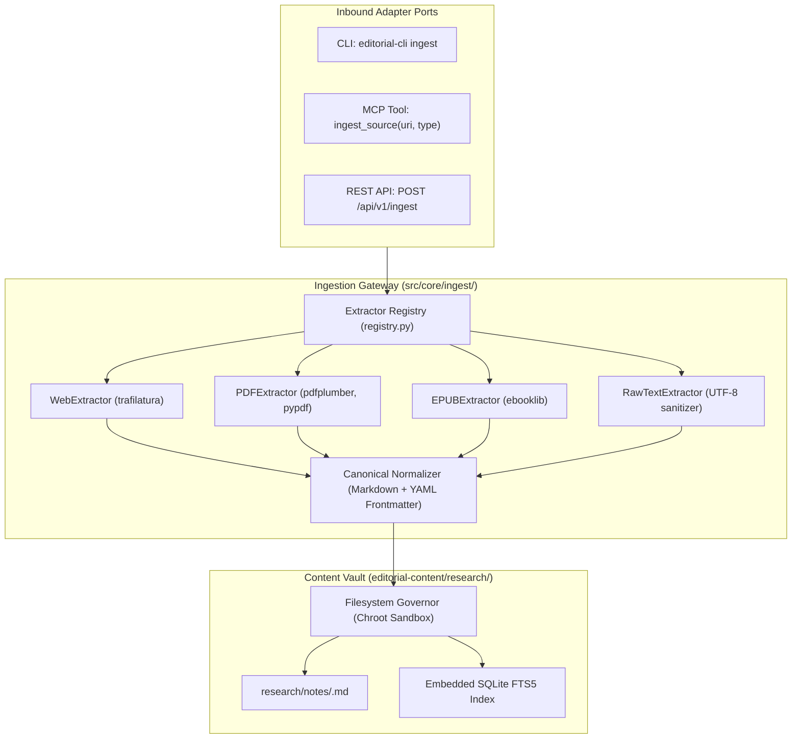
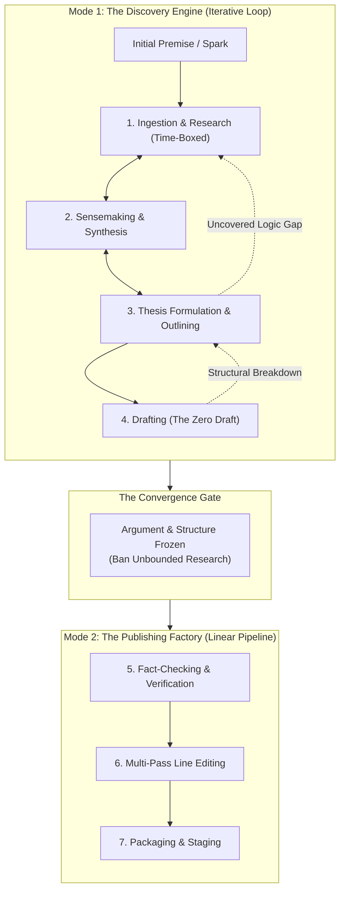

# RFC 0001: Multi-Plane Repository Topology and Editorial Pipeline Architecture

## 1. Overview / Summary

This Request for Comments (RFC) articulates the architectural decomposition and multi-repository topology for an AI-assisted editorial and publishing platform targeting Substack and long-form technical publications. The core design decouples software engineering governance and tool source code from the authoring workspace and operational deployment environments.

By formalizing the separation into three primary planes—**Tooling & Governance (`editorial-engine`)**, **Editorial & Content (`editorial-content`)**, and **Deployment & Infrastructure (`editorial-ops`)**—the system eliminates context window pollution, prevents operational secret leakage into authoring spaces, and establishes decoupled, multi-adapter integration boundaries across all lifecycles.



---

## 2. Problem Statement & Context

Coupling editorial prose, raw research artifacts, tool source code, and deployment automation within a monolithic repository degrades both the authoring experience and engineering lifecycle:

1. **Context Window Contamination:** Modern agentic LLM assistants (e.g., Antigravity, Gemini CLI) recursively scan workspace trees. Ingesting infrastructure manifests, node modules, Python virtual environments, and test fixtures during a drafting session wastes token budgets and causes hallucinations.
2. **Security & Boundary Violation:** Staging drafts to Substack requires session tokens, browser automation cookies, or platform credentials. Storing or referencing these credentials in an authoring workspace presents accidental leakage risks.
3. **Mismatched Lifecycles:** Editorial drafts evolve non-linearly with rapid commits and revisions. Infrastructure and platform tooling require strict versioning, linting, regression testing, and architectural review (MADRs, SDDs).
4. **Tool Portability Constraints:** Hardcoding custom scripts to specific file paths prevents re-using the editorial tooling across multiple distinct publications or private research vaults.

### Goals & Non-Goals

* **Goals:**
  * Define strict physical and logical repository boundaries for the editorial ecosystem.
  * Define a decoupled, multi-adapter communication model (CLI, MCP, REST) connecting authoring environments to the core editorial domain.
  * Guarantee zero source code and zero operational credentials reside within the writing workspace.
  * Establish a clear 7-stage professional editorial lifecycle framework (Research $\rightarrow$ Synthesis $\rightarrow$ Outlining $\rightarrow$ Drafting $\rightarrow$ Fact-Checking $\rightarrow$ Line Editing $\rightarrow$ Packaging).
* **Non-Goals:**
  * Re-implementing a native Markdown editor (the system integrates with existing editors via standard MCP clients).
  * Supporting multi-tenant collaborative SaaS drafting in phase 1 (focused on single-author sovereign homelab workflow).

---

## 3. Proposed Architecture & Repository Topology

### 3.1 Repository Taxonomy Breakdown

| Repository Name | Target Persona | Plane / Responsibility | Authoritative Contents |
| :--- | :--- | :--- | :--- |
| **`editorial-engine`** | Software Engineer / System Architect | **Governance & Source Code Plane** | • `architecture/` (RFCs, MADRs, IEEE 1016 SDDs, OpenAPI/JSON-RPC schemas).<br>• Core source code for custom MCP servers (`src/`).<br>• Custom linter definitions, style rule engines, and readability evaluators.<br>• Unit, integration, and contract tests. |
| **`editorial-content`** | Writer / Research Essayist | **Authoring & Editorial Plane** | • `research/` (Clips, PDFs, reading notes, citations).<br>• `drafts/` (Active essays, structural outlines, revision histories).<br>• `assets/` (Visual diagrams, cover images, tables).<br>• `.gemini/` (Editorial persona directives, voice guidelines).<br>• *Zero application code, zero build tools, zero deployment scripts.* |
| **`editorial-ops`** | Systems / DevOps Operator | **Deployment & Staging Plane** | • Container and process management manifests.<br>• Secret management bindings for platform authentication.<br>• Automated collectors and delivery scripts publishing finished content to Substack. |

#### 3.1.1 Explicit Resource & Responsibility Boundaries

To maintain strict architectural isolation, each repository enforces an authoritative resource boundary:

| Boundary Dimension | `editorial-engine` | `editorial-content` | `editorial-ops` |
| :--- | :--- | :--- | :--- |
| **Primary Artifacts** | Python library code, adapters, linters, schemas, test suites. | Markdown essays, raw PDF research, local notes, SVG/image assets. | Docker Compose files, systemd units, environment secret configs. |
| **Transformation vs. Delivery** | **OWNS Transformation:** Compiles Markdown AST to Substack ProseMirror JSON. | **OWNS Creation:** Authors and edits human/AI prose drafts. | **OWNS Delivery:** Authenticates and stages compiled payloads to Substack endpoints. |
| **Credentials & Secrets** | **ZERO:** Holds no platform credentials or cookies. | **ZERO:** Holds no platform credentials or cookies. | **EXCLUSIVE:** Manages Substack sessions, API keys, and deployment tokens. |
| **Runtime Role** | Stateless computational engine and adapter host. | Passive workspace mounted by engine/adapters. | Process supervisor and outbound network dispatcher. |

---

### 3.2 Hexagonal Architecture & Deterministic Core Tooling

To ensure sovereignty, resilience, and operational flexibility, `editorial-engine` is designed using the **Hexagonal Architecture (Ports & Adapters)** pattern. The system is fundamentally decoupled from any single transaction protocol or LLM client.

**Language Standardization:** Python (3.12+) is the mandatory language for all core application services, library logic, deterministic linters, and protocol adapters across `editorial-engine`.



#### 1. Core Domain Sub-Modules (`editorial-engine/src/core/`)
Implemented in pure, framework-agnostic Python without external network or transport dependencies:

* **Security & Librarian (`src/core/librarian/` & `src/core/security/`):**
  * *Filesystem Governor:* Enforces a strict virtual sandbox, ensuring file operations cannot escape the configured publication root.
  * *Research Indexer & Doc Extractors:* Deterministically extracts clean text and data tables from PDFs/EPUBs (`pypdf`, `pdfplumber`) and builds an embedded, zero-cloud keyword search index via SQLite FTS5.
  * *Citation Resolver:* Validates citation keys against BibTeX/CSL archives (`pybtex`).
* **Deterministic Prose & Style Analytics (`src/core/analysis/`):**
  * *Readability Metrics:* Real-time statistical analysis using `textstat` (Flesch Reading Ease, Flesch-Kincaid Grade Level, Lexical Diversity).
  * *Style & Cliché Linting:* Programmatic integration of Vale rules and `proselint` to enforce house style guidelines, flagging corporate jargon and redundant phrasing.
  * *Voice & Cadence:* AST-level pattern matching identifying excessive passive voice, adverb density, and monotonous sentence lengths.
* **Verification & Draft Hygiene (`src/core/hygiene/`):**
  * *`[TK]` Sentinel Verifier:* Scans drafts to guarantee zero unfulfilled `[TK]` placeholders or broken section links prior to publication.
  * *Typography Normalizer:* Automatically converts straight quotes to smart/curly quotes, standardizes em-dashes (`---` $\rightarrow$ `—`), and eliminates non-standard whitespace.
* **AST Compilation (`src/core/transformers/`):**
  * *ProseMirror Compiler:* Parses Markdown into a semantic AST (`markdown-it-py`) and translates it deterministically into Substack's native ProseMirror JSON document schema.

#### 2. Protocol Adapters (`editorial-engine/src/adapters/`)
All adapters are written in Python and maintained directly inside `editorial-engine`, exposing distinct interaction surfaces over the identical core library:

* **CLI Adapter (`src/adapters/cli/`):** Provides a direct command-line interface for human authors and automated shell scripts (e.g., `editorial-cli lint drafts/essay.md`).
* **MCP Adapter (`src/adapters/mcp/`):** Exposes core functions as MCP Tools, Resources, and Prompts over `stdio` and `SSE` for AGY, Gemini, Cursor, or Claude Desktop.
* **REST API Adapter (`src/adapters/rest/`):** Implements a standard HTTP REST service using FastAPI, generating interactive OpenAPI 3.1 contracts (`/docs`) for programmatic webhooks or web dashboards.

#### 3. Embedded Multi-Extractor Micro-Pipeline (`src/core/ingest/`)

To support Stage 1 (Ingestion & Research) without heavy external daemons or GPU-based OCR systems, the engine implements a local-first, Python-native micro-pipeline:



##### A. Extractor Registry (`src/core/ingest/registry.py`)
A pluggable Python registry where format-specific drivers register against target MIME types, file extensions, and URI schemes:
* **`WebExtractor` (`trafilatura`):** Deterministically scrapes article prose from URLs, stripping navigation bars, advertisements, cookie modals, and tracking scripts.
* **`PDFExtractor` (`pdfplumber` / `pypdf`):** Extracts textual streams and structured tables from academic research papers, whitepapers, and reports.
* **`EPUBExtractor` (`ebooklib`):** Ingests and formats chapters from technical e-books.
* **`RawTextExtractor`:** Sanitizes raw text streams, clipboards, or synthesized outputs generated by AGY / Gemini prompts.

##### B. Canonical Output Contract
Every extracted asset is normalized to a structured CommonMark document enriched with authoritative metadata and stored under `editorial-content/research/notes/<slug>.md`:

```yaml
---
title: "Extracted Document Title"
source_uri: "https://example.com/research-paper"
source_type: "web" # web | pdf | epub | raw_text
captured_at: "YYYY-MM-DDTHH:MM:SSZ"
content_hash: "sha256:4f3a..."
author: "Author Name or N/A"
tags: ["unclassified"]
---

# Extracted Document Title

[Normalized CommonMark prose, tables, and blockquotes extracted from source]
```

##### C. Multi-Adapter Port Exposure
The ingestion micro-pipeline is exposed uniformly across all three adapters:
* **CLI Port:** `editorial-cli ingest <url_or_filepath> [--tags tag1,tag2]`
* **MCP Port:** Tool `ingest_source(source: str, source_type: str, tags: list[str])`
* **REST API Port:** `POST /api/v1/ingest` with request body `{"source": "...", "source_type": "auto", "tags": [...]}`

---

### 3.3 The 7-Stage Editorial Lifecycle: Two Operating Modes

Rather than an inflexible waterfall sequence, the editorial and authoring workflow operates in two distinct operational modes separated by a formal **Convergence Gate**:

* **Mode 1: The Discovery Engine (Iterative / Recursive):** Stages 1 through 4 are inherently dialectical and non-linear. An initial premise prompts research, which informs synthesis, which refines the thesis, exposing logic gaps that trigger targeted research spikes.
* **Mode 2: The Publishing Factory (Deterministic / Linear):** Stages 5 through 7 engage once the structural argument is frozen. Work shifts from creative discovery to mechanical verification, stylistic polishing, and asset compilation.



#### Detailed Stage Breakdown

1. **Stage 1: Ingestion & Research:** Systematic capture of primary source materials, academic publications, whitepapers, interview transcripts, and bookmarks into local archives.
   * *Requirement: Time-Boxed Research Spikes:* To prevent the "infinite research spiral" anti-pattern, research phases must operate under explicit time bounds or bounded scopes (e.g., investigating a specific counter-argument for a fixed window before advancing).
2. **Stage 2: Sensemaking & Synthesis:** Extracting core patterns, claims, tensions, and verified data points from research materials into a structured research brief without drafting prose.
3. **Stage 3: Thesis Formulation & Outlining:** Establishing the central thesis statement (governing thought) and building a detailed hierarchical outline (e.g., Minto Pyramid structure) mapping arguments to citations.
4. **Stage 4: Drafting (The Zero Draft):** Rapid, unconstrained translation of the outline into full prose, deliberately bypassing internal self-critique and using placeholders (`[TK]`) for missing data to preserve velocity.
5. **Stage 5: Fact-Checking & Verification:** Rigorous verification pass resolving all `[TK]` placeholders, validating claims against primary sources, and verifying numerical accuracy.
6. **Stage 6: Multi-Pass Line Editing:** Progressive editorial passes refining voice, cadence, clarity, and grammatical hygiene (structural flow $\rightarrow$ line editing $\rightarrow$ copyediting/proofreading).
7. **Stage 7: Packaging & Staging:** Assembly of publication-ready assets including headlines, email pre-headers, pull quotes, 16:9 banner art, and social hooks prior to handing off to operations for publishing.

---

## 4. Alternatives Considered: Single-Protocol Coupling vs. Multi-Adapter Core

* **Option A: Protocol-Coupled Engine (Anti-Pattern):** Hardcoding the core domain logic directly into an MCP server or REST framework couples the system to a single consumer. If LLM access is interrupted, human authors cannot execute linters or staging pipelines locally.
* **Option B: Multi-Adapter Hexagonal Core (Recommended):** Isolating the pure editorial logic in `src/core/` and implementing thin adapters (`CLI`, `MCP`, `REST`) within `editorial-engine`. This preserves human authoring sovereignty via the CLI while enabling seamless, zero-glue integration for AI agent runtimes via MCP and automated webhooks via REST.

---

## 5. Security, Risk & Operational Impact

* **Secret Isolation:** Substack session tokens, session cookies, and API secrets are never checked into `editorial-content` or exposed to the client LLM context. They are managed exclusively within the operational plane (`editorial-ops`).
* **Filesystem Containment:** `editorial-engine` operates only on paths explicitly designated for authoring. Path traversal outside the configured publication root is rejected.
* **Failure Modes:** If `editorial-engine` is offline, the writer's ability to author, review, or edit local Markdown files remains completely functional; only AI assistance is temporarily unavailable.

---

## 6. Next Steps

1. Review and ratify this high-level repository topology and lifecycle proposal.
2. Define the functional requirements and editorial interaction models for Stages 1 through 7 prior to designing specific MCP primitives.
3. Perform RFC review
