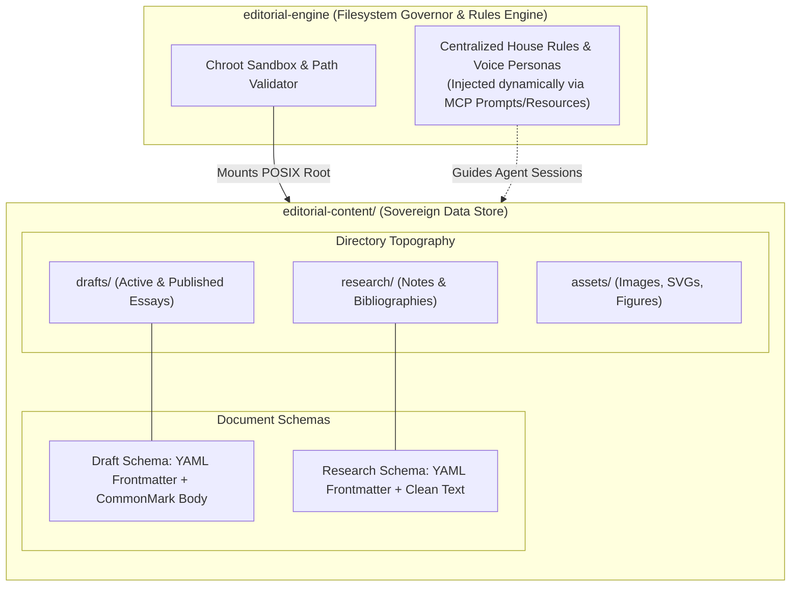

# RFC 0002: Editorial Content Filesystem Schema and Data-Store Contract

## 1. Overview / Summary

This RFC establishes the filesystem architecture, directory layout, document schemas, and governing policies for the **`editorial-content`** repository. 

In our multi-plane architecture (defined in [RFC 0001](file:///home/michael/src/github.com/mnaatjes/editorial-engine/architecture/rfcs/0001_multi_plane_repository_topology.md)), `editorial-content` serves as the authoritative, sovereign **Data / Model Tier**. It houses all raw research materials, synthesized notes, working drafts, and visual media assets. 

This RFC specifies a **minimal, flat, and standard-compliant data-store** that maximizes writer ergonomics in standard Markdown editors (e.g., Obsidian, VS Code, Neovim) while providing deterministic boundary contracts for ingestion, linting, and AST compilation by `editorial-engine`.



---

## 2. Problem Statement & Scope

Without an explicit structural contract, authoring repositories degenerate into chaotic filing systems:
1. **Arbitrary Directory Sprawl:** Deep, nested topic hierarchies make manual filing tedious and break relative asset links.
2. **Schema Inconsistency:** Inconsistent frontmatter metadata prevents automated linters and search indexers from reliably determining an essay's status, tags, or citations.
3. **Tool Lock-in:** Using proprietary application formatting or non-standard syntax breaks readability outside specific software tools.

### Goals & Non-Goals

* **Goals:**
  * Define a minimalist, shallow directory topography optimized for human writing velocity.
  * Establish strict, machine-readable YAML frontmatter contracts for drafts and research notes.
  * Define explicit filesystem policies (naming conventions, encoding, immutability, asset linking).
  * Register anti-patterns to prevent architectural creep into the content plane.
  * Guarantee zero AI configuration/rules directories (e.g., `.gemini/`) reside in the content vault; behavioral directives are centralized in `editorial-engine`.
* **Non-Goals:**
  * Define the internal database schema of `editorial-engine` (e.g., SQLite FTS5 index tables).
  * Specify automated publishing or deployment scripts (isolated strictly to `editorial-ops`).

---

## 3. Directory Topography & Layout

The directory structure of `editorial-content` is intentionally kept flat (maximum depth of 2 levels) to eliminate filing friction and simplify path resolution. It contains strictly pure content and assets, with zero agent prompt or configuration directories.

To accommodate complex issues that cannot be composed into a single draft, `drafts/` supports two structural forms:
1. **Standalone Drafts:** Flat Markdown files (`drafts/YYYY-MM-DD_slug.md`).
2. **Single-Level Series Bundles:** A dedicated directory (`drafts/YYYY-MM-DD_series-slug/`) containing partitioned part files and an optional `series.yaml` outline.

```text
editorial-content/
├── drafts/                                # All long-form essays and publications
│   ├── 2026-09-27_standalone-post.md     # Pattern 1: Standalone post
│   ├── 2026-10-01_distributed-consensus/ # Pattern 2: Single-level series bundle folder
│   │   ├── series.yaml                    # Master series outline & publication schedule
│   │   ├── part-1_raft-basics.md          # Chapter / part draft
│   │   └── part-2_log-compaction.md       # Chapter / part draft
│   └── ...
├── research/                              # Ingested primary sources & synthesis notes
│   ├── notes/                             # Normalized CommonMark research summaries
│   │   └── attention-paper.md
│   ├── bibliography.bib                   # Optional master BibTeX citation register
│   └── glossary.yaml                      # Publication-wide controlled lexicon & terminology
└── assets/                                # Static visual media referenced by drafts
    ├── 2026-09-27_standalone-post/        # Asset folder scoped per standalone article
    │   ├── banner.png                     # 16:9 publication cover image
    │   └── figure-1.svg                   # Inline architecture diagram
    └── 2026-10-01_distributed-consensus/  # Asset folder scoped per series bundle
        ├── part-1_figure.svg
        └── part-2_figure.svg
```

> **Directives Boundary Note:** AI behavioral rules, style guidelines, and persona prompts do not reside in `editorial-content`. They are centrally maintained in `editorial-engine` and streamed into the authoring session dynamically via the MCP adapter (using MCP Prompts and Resources).

---

## 4. Document Schemas & Contracts

All content within `editorial-content` consists of UTF-8 CommonMark Markdown with mandatory YAML frontmatter.

### 4.1 Draft Document Contract (`drafts/*.md` or `drafts/*/*.md`)

Every essay or article must begin with the standard `DraftDocument` frontmatter header:

```yaml
---
title: "Article or Publication Title"
slug: "article-slug-for-url"
status: "draft" # draft | review | ready_for_ops | published
created_at: "YYYY-MM-DD"
last_updated_at: "YYYY-MM-DD"
target: "substack"
tags: ["systems", "architecture"]
summary: "Single-sentence executive summary or email pre-header."
cover_image: "../assets/2026-09-27_standalone-post/banner.png"
series: # Optional: Used when part of a multi-part series or chaptered bundle
  id: "distributed-consensus"
  title: "Deconstructing Distributed Consensus"
  part: 1
  total_parts: 2 # optional or open-ended
citations:
  - key: "vaswani2017"
    source: "research/notes/attention-paper.md"
---

# Article or Publication Title

Draft body prose adheres strictly to CommonMark.
Unresolved facts or statistics must declare explicit `[TK]` sentinels:
> Revenue grew by [TK: pull Q3 ARR number] year-over-year.
```

#### Status Lifecycle State Machine
* `draft`: Active authoring; Mode 1 (Discovery Engine). Rapid revisions and structural changes permitted.
* `review`: Mode 2 (Publishing Factory). Structural argument frozen; active line-editing, fact-checking, and linting.
* `ready_for_ops`: Convergence Gate passed. Zero `[TK]` sentinels, linter passes clean, assets compiled for `editorial-ops`.
* `published`: Post has been staged or dispatched to the publication target. Immutable archive.

---

### 4.2 Research Note Contract (`research/notes/*.md`)

Normalized research notes generated by the Ingestion Pipeline or authored manually must adhere to the `ResearchDocument` contract. To enable deterministic generation of citations in **AP**, **Chicago (Author-Date & Notes)**, and **APA** formats without LLM hallucination, the frontmatter enforces standardized bibliographic ontology fields (aligned with Citation Style Language / BibTeX):

```yaml
---
citation_key: "vaswani2017" # Unique ID referenced by drafts (e.g. [@vaswani2017])
title: "Attention Is All You Need"
authors:
  - family: "Vaswani"
    given: "Ashish"
  - family: "Shazeer"
    given: "Noam"
publication: "Advances in Neural Information Processing Systems" # Journal, website, or publishing outlet
published_date: "2017-06-12" # YYYY-MM-DD or YYYY (required for APA/Chicago author-date)
source_uri: "https://arxiv.org/abs/1706.03762"
doi: "10.48550/arXiv.1706.03762" # Optional: DOI for academic papers or ISBN for books
source_type: "academic_paper" # web | academic_paper | book | interview | report | raw_text
captured_at: "2026-09-27T19:51:00Z" # Access timestamp (required for Chicago web citations)
content_hash: "sha256:4f3a..."
tags: ["transformer", "deep-learning"]
---

# Attention Is All You Need

## Core Thesis & Key Findings
* Bulleted key takeaways and verified factual assertions extracted from source.

## Significant Quotes & Claims
> "Exact quotation with page or section reference." (p. 4)

## Extracted Tables / Structured Data
| Metric | Baseline | Proposed |
| :--- | :--- | :--- |
| BLEU Score | 28.4 | 41.8 |
```

---

### 4.3 Glossary & Controlled Lexicon Contract (`research/glossary.yaml`)

To eliminate "synonym drift" (e.g., using *worker node*, *agent*, and *replica* inconsistently across issues) and preserve terminology precision throughout the publication, repository-wide concepts are defined in `research/glossary.yaml`:

```yaml
---
# Publication Controlled Lexicon
version: "1.0.0"
last_updated: "YYYY-MM-DD"
---
terms:
  - term: "Consensus Engine"
    slug: "consensus-engine"
    definition: "The core state-machine replication subsystem responsible for leader election and log synchronization."
    preferred_usage: "Consensus Engine"
    forbidden_variants:
      - "consensus manager"
      - "voting master"
      - "sync daemon"
    citation: "research/notes/raft-paper.md" # Provenance source
    tags: ["distributed-systems", "core"]
```

#### Lifecycle & Editorial Phase Integration

1. **Discovery & Definition (Stages 1–3):**
   * *Writer Trigger:* When reading source literature or drafting an outline, the author encounters an overloaded or technical term.
   * *Action:* The writer conducts a time-boxed research spike, extracts the authoritative definition, and registers it in `research/glossary.yaml`.
2. **Deterministic Enforcement (Stage 6: Multi-Pass Line Editing):**
   * During Stage 6 line-editing, `editorial-engine`'s Prose Linter (`src/core/analysis/`) loads `research/glossary.yaml`.
   * **Forbidden Variant Linting:** Scans the draft AST for any registered `forbidden_variants` and raises warnings with automated replacement suggestions.
   * **First-Mention Definition Linking:** Identifies the first occurrence of a defined glossary term in an essay, suggesting an inline definition, tooltip, or footnote for reader clarity.
   * **Capitalization Hygiene:** Enforces casing consistency (e.g., flagging `ebpf` or `Ebpf` when `eBPF` is the preferred usage).

---

## 5. Governing Filesystem Policies

All operations within `editorial-content` must comply with four mandatory policies:

1. **Policy 1: Universal Portability & Zero Code:**
   * `editorial-content` must contain **zero application source code**, zero build manifests (`package.json`, `pyproject.toml`), and zero deployment scripts.
   * Every file must be natively readable and editable in any standard Markdown editor.
2. **Policy 2: Predictable POSIX Naming:**
   * All directories and files must use lowercase alphanumeric characters, numbers, dashes, and underscores (`[a-z0-9_-]`).
   * Filenames must never contain whitespace, special characters, or uppercase letters.
   * Drafts must follow the naming pattern: `YYYY-MM-DD_slug-name.md`.
3. **Policy 3: Relative & Localized Asset Isolation:**
   * Media assets must reside inside `assets/<draft-slug>/` and be referenced using relative paths (e.g., ``).
   * External remote image links (e.g., hotlinked Imgur/CDN images) are prohibited to guarantee offline data sovereignty.
4. **Policy 4: Append-Only Research & State Immutability:**
   * Research notes in `research/notes/` are immutable historical records of source material at the time of capture.
   * Drafts in `drafts/` are append-and-revise, but once marked `status: published`, they must not be rewritten. Subsequent corrections or errata must be appended as revisions.

### 5.1 Git Operations & Version Control Sovereignty

`editorial-content` is an autonomous Git repository governed by strict boundaries regarding version control operations:

#### 1. What `editorial-content` Owns & Direct Human Authority
* **Human-Exclusive Commit Authority:** All Git version control operations (`git add`, `git commit`, `git branch`, `git merge`, `git push`) within `editorial-content` are strictly reserved for the **human writer**.
* **Zero AI / Engine Commits:** Background tools, AI agents (AGY/Gemini/Claude), and `editorial-engine` processes are **explicitly prohibited from executing Git commits** inside `editorial-content`. 
* **Audit Trail Integrity:** The Git commit history represents the author's sovereign cognitive journal and deliberate publication milestones. Automated systems must never pollute this history with machine-generated commits.

#### 2. What `editorial-engine` Can and CANNOT Do in `editorial-content`
* **What `editorial-engine` CAN Do:**
  * **Read:** Inspect drafts, research notes, and assets via the Filesystem Governor to execute linters, readability analytics, citation verification, and AST compilation.
  * **Write:** Save extracted research notes into `research/notes/`, update normalized typography, or output compiled assets into the working tree.
* **What `editorial-engine` CANNOT Do:**
  * **CANNOT run Git commands:** It must never execute `git init`, `git add`, `git commit`, `git checkout`, `git reset`, or `git push` targeting `editorial-content`.
  * **CANNOT auto-commit modifications:** Any file generated or modified by an engine tool (e.g., an ingested research note or lint autofix) is left in the working tree as an **unstaged modification** for explicit human inspection, review, diffing, and manual commit.

---

## 6. Anti-Patterns to Avoid (Registered Hazards)

To preserve system longevity, the following anti-patterns are explicitly registered and forbidden:

| Anti-Pattern Name | Description & Hazard | Governing Enforcement |
| :--- | :--- | :--- |
| **1. The Deep Taxonomy Anti-Pattern** | Creating deep nested directories by category (e.g., `research/tech/ai/llm/agents/2026/`). Causes filing friction and broken relative paths. | **Enforce flat directories:** Group purely by document type (`drafts/`, `research/notes/`). Use YAML `tags:` for categorization. |
| **2. The Proprietary Markup Anti-Pattern** | Inventing custom bracket syntax, non-standard callouts, or tool-specific tags that break standard CommonMark parsers. | **Enforce CommonMark standard:** Use standard blockquotes `>` or standard YAML frontmatter for custom attributes. |
| **3. The Shared State / Database Leak Anti-Pattern** | Storing database files (`index.db`), lock files, or temporary cache directories inside `editorial-content`. | **Enforce stateless vault:** All caches and SQLite indices belong in `editorial-engine/.cache/` or system temp spaces. |
| **4. The Secret Leakage Anti-Pattern** | Storing Substack session cookies, API tokens, or credentials in draft frontmatter or environment files in the vault. | **Enforce zero credentials:** `editorial-content` has zero secrets. Credentials reside strictly in `editorial-ops`. |
| **5. The Split-Brain Workspace Anti-Pattern** | Mixing application development notes or infrastructure runbooks with publication content. | **Enforce pure editorial focus:** Ops documentation lives in `homelab-ops` or `editorial-ops`. Only public/publication content lives here. |
| **6. The Agent Config Leakage Anti-Pattern** | Committing agent prompt engineering files or rule folders (`.gemini/`, `.cursor/`, prompt text) into the content repository. | **Enforce centralized rule governance:** Behavioral prompts and rules reside in `editorial-engine` and are injected dynamically via MCP. |

---

## 7. Next Steps

1. Complete RFC 0002 review and obtain user consensus.
2. Apply the initial schema template and directory layout to `/home/michael/src/github.com/mnaatjes/editorial-content/`.
3. Proceed to RFC 0003 specifying the Filesystem Governor and validation rules in `editorial-engine`.
